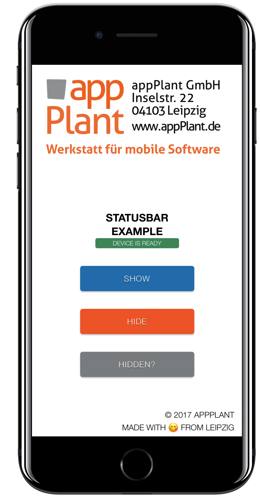

Cordova Statusbar Plugin - Sample App
======================================

[Cordova][cordova] plugin to prevent the app from going to sleep while in background, device get locked or screen goes off.

## Instructions

Clone the _example_ branch:

    git clone -b example https://github.com/katzer/cordova-plugin-hidden-statusbar-overlay.git

And then execute:

    cordova run ios

These will lunch the simulator or any plugged in device and start the example application as seen below in the screenshots. It is also possible to open the project [Xcode][xcode].

Please read the plugin's [README][readme] for further informations.

## License

This software is released under the [Apache 2.0 License][apache2_license].

Made with :yum: from Leipzig

© 2013 [appPlant GmbH][appplant]

[cordova]: https://cordova.apache.org
[readme]: https://github.com/katzer/cordova-plugin-hidden-statusbar-overlay/blob/master/README.md
[xcode]: https://developer.apple.com/xcode/
[apache2_license]: http://opensource.org/licenses/Apache-2.0
[appplant]: www.appplant.de
